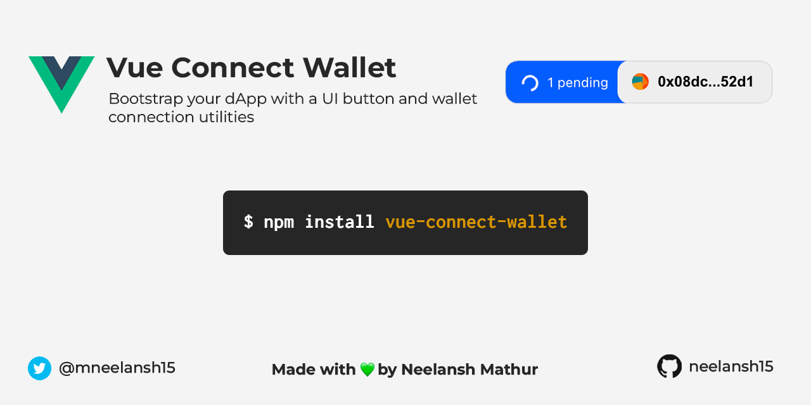

<h1 align="center">vue-connect-wallet</h1>

<p align="center">
    
    
</p>

Bootstrap your decentralized applications by delegating the tedious and repetitive task of wallet connection and button design to this plugin.  

Provides a ready-made and fully-customizable UI button and utility functions for connecting to a web3 wallet (MetaMask). It has built-in Typescript support and supports Dark mode.

The button takes care of displaying the user's wallet address, their identicon / avatar and pending transactions.  
Utility functions for connecting to a MetaMask wallet are provided. More wallets can be added in the future as per public request. Feel free to contribute yourself!  

**Table of Contents**
- [Getting started](#getting-started)
  - [Installation](#installation)
  - [Registering the component](#registering-the-component)
- [Usage](#usage)
  - [Button component](#button-component)
    - [Simple usage](#simple-usage)
    - [Advanced Usage](#advanced-usage)
  - [MetaMask Utils](#metamask-utils)
- [Example](#example)
- [Contributing](#contributing)
- [Miscellaneous](#miscellaneous)
- [Stargazers](#stargazers)
- [Author](#author)

# Getting started
This plugin uses `vue-demi` to support both Vue 2 and Vue 3, but usage in Vue 2 is prone to issues, so **Vue 3** is the recommended version of vue for this plugin.

## Installation
Use Yarn or npm to install the library **vue-connect-wallet**.

```console
yarn add vue-connect-wallet
```

```console
npm install vue-connect-wallet
```

## Registering the component
In the `main.js` file, import the styles.
```js
import "vue-connect-wallet/dist/style.css";
```

Then, you can either register **ConnectWalletButton** as a global component or specifically import it in the components you need (recommended).  

To register as global component, in your `main.js`:
```js
import VueConnectWallet from 'vue-connect-wallet'
createApp(App).use(VueConnectWallet).mount("#app");
```

To import individually (recommended):
```js
import { ConnectWalletButton } from 'vue-connect-wallet'
export default {
    components:{
        ConnectWalletButton
    }
}
```
***Note**: If using &lt;script setup&gt;, you only need to import the component without registering it.*

# Usage
## Button component
If the `address` is **empty** or doesn't start with **0x**, the "Connect Wallet" button will be shown. If an address is provided, it will instead display the identicon and the sliced address.
### Simple usage
```html
<ConnectWalletButton address="0x00" />
```

### Advanced Usage
```html
<ConnectWalletButton
    address="0x00"
    :txnCount="0"
    :dark="false"
>
    <!-- Override the default text on the "Connect Wallet" button -->
    Connect Wallet!

    <template #pending>
        <!-- Override the blue pending transaction div -->
    </template>

    <template #spinner>
        <!-- Use your own Spinner (svg, css, image, etc.) -->
    </template>

    <template #identicon>
        <!-- Use your own identicon library. Jazzicon is the default -->
    </template>

    <template #connectWalletButton>
        <!-- Use your own button for the "Connect Wallet" state when no address is provided -->
    <template>

    <template #addressButton>
        <!-- Use your own button to display the address when address is provided. Does not remove the pending transaction div -->
    </template>
</ConnectWalletButton>
```

## MetaMask Utils
Provides functions to easily connect to a MetaMask wallet, get accounts and listen to changes when an account is changed and when a chain/network is changed.

```js
import { useMetaMaskWallet } from 'vue-connect-wallet'

const wallet = useMetaMaskWallet()
```

Utilities provided in `useMetaMaskWallet`:
```ts
/** Returns boolean value indicating if MetaMask is detected on the browser **/
wallet.isMetaMask: boolean;
/**
 * Returns account address array if wallet is connected otherwise opens MetaMask popup.
 * On error, returns a single string with the error message
 */
wallet.connect(): Promise<string | string[]>;
/**
 * Get all connected accounts addresses. Returns an empty array if none connected
 * On error, returns a single string with the error message
 */
wallet.getAccounts(): Promise<string | string[]>;
/**
 * Opens a MetaMask popup to connect/disconnect from a list of user's accounts. Returns an array.
 * The popup opens even if the user has already connected some accounts.
 * On error, returns a single string with the error message
 */
wallet.switchAccounts(): Promise<string | string[]>;
/**
 * Event handler for when the user changes the account in MetaMask
 *
 * Reference for event handlers: https://docs.metamask.io/guide/ethereum-provider.html#events
 * @param callback Function that takes accounts string array as an argument
 */
wallet.onAccountsChanged: (callback: (accounts: string[]) => void) => void;
/**
 * Event handler for when the user changes the active chain in MetaMask
 *
 * Reference for event handlers: https://docs.metamask.io/guide/ethereum-provider.html#events
 * @param callback Function that takes chainId number as an argument
 */
wallet.onChainChanged: (callback: (chainId: number) => void) => void;
```

# Example
Example usage in Vue 3 with Typescript, using &lt;script setup lang="ts"&gt;:
```ts
import { useMetaMaskWallet } from 'vue-connect-wallet'

const address = ref('');
const wallet = useMetaMaskWallet();

wallet.onAccountsChanged((accounts: string[]) => {
  console.log("account changed to: ", accounts[0]);
});
wallet.onChainChanged((chainId: number) => {
  console.log("chain changed to:", chainId);
});

const connect = async () => {
  const accounts = await wallet.connect();
  if (typeof accounts === "string") {
      console.log("An error occurred" + accounts);
  };
  address.value = accounts[0];
};

const switchAccount = async () => {
  await wallet.switchAccounts();
  connect();
};

const isConnected = async () => {
  const accounts = await wallet.getAccounts()
  if(typeof accounts === 'string') return false
  return accounts.length > 0
}
```

# Contributing
Conribution in any area is welcome. Adding support for new wallets would be very much appreciated.

To develop in this repo, just clone it and run `yarn` to install all the dependencies. Look at the `package.json` to understand the scripts.

# Miscellaneous

**Note on Identicons (Jazzicon)**  
This package comes with the Jazzicon from the library [vue3-jazzicon](https://github.com/samuveth/vue3-jazzicon). Installing it as a dependency in the plugin raised import errors due to which I bundled the component in this plugin itself.

# Stargazers
[](https://github.com/neelansh15/vue-connect-wallet/stargazers)

# Author
Hi! I am Neelansh Mathur. I am a freelancer specializing in Frontend development for Blockchain applications, and currently studying Computer Engineering. You can find out more about me at my social links.  

I made this plugin because I was having to repeatedly use the same code and redesign buttons for every dApp I develop for. This has made my life easier and I hope it does the same for you 💚.

**Twitter**: https://twitter.com/mneelansh15  
**LinkedIn**: https://www.linkedin.com/in/neelansh-mathur/  
**Dev.to**: https://dev.to/neelansh15  
**Github**: https://github.com/neelansh15  

